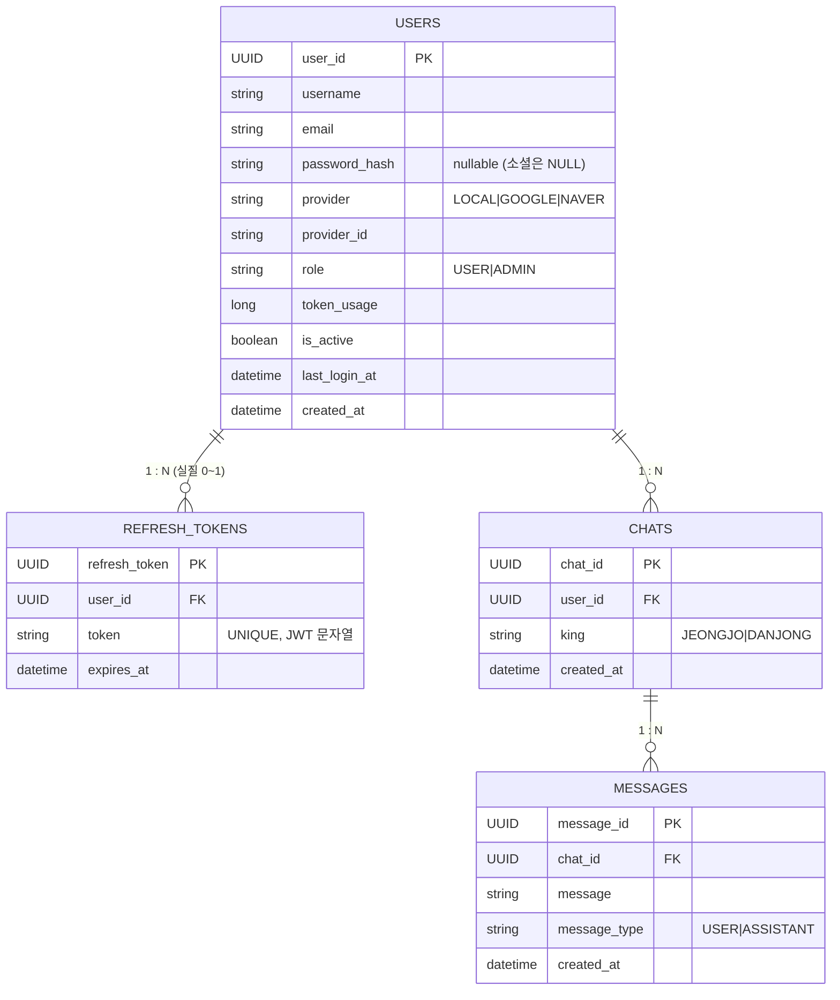

# Histolog Backend

## 기술 스택

| 영역 | 사용 기술 |
|---|---|
| 언어 / 런타임 | Java 17 |
| 프레임워크 | Spring Boot 3.5.8, Spring Security, Spring Data JPA, Spring Validation |
| 인증 | 자체 JWT (jjwt 0.12.6) + Google / Naver OAuth2 |
| DB | Oracle (`ojdbc11`) |
| 빌드 | Gradle |
| 기타 | Lombok, spring-dotenv, google-api-client |

## 빠른 시작

### 1. 환경 변수 (`.env`)

```dotenv
DB_USERNAME=...
DB_PASSWORD=...
JWT_SECRET=<32바이트 이상 권장>

GOOGLE_CLIENT_ID=...
GOOGLE_CLIENT_SECRET=...
GOOGLE_CALLBACK_URI=http://localhost:8080/api/auth/google/callback

NAVER_CLIENT_ID=...
NAVER_CLIENT_SECRET=...
NAVER_CALLBACK_URI=http://localhost:8080/api/auth/naver/callback

AI_SERVER_URL=http://127.0.0.1:8000
```

### 2. 로컬 실행

```bash
./gradlew bootRun
```

### 3. Docker

```bash
docker compose up --build
```

## 프로젝트 구조

```
src/main/java/com/example/histologbe
├── HistologBeApplication.java
├── config/         # SecurityConfig, JwtProvider, JwtAuthenticationFilter
├── controller/     # AuthController, UserController, ChatController, MessageController
├── service/        # AuthService, UserService, ChatService, MessageService
├── repository/     # JPA repositories
├── domain/         # 엔티티 (User, RefreshToken, Chat, Message + enum들)
├── dto/            # 요청 / 응답 DTO
└── exception/      # ErrorCode, CustomException, GlobalExceptionHandler
```

## 인증 개요

- 모든 보호 경로는 `Authorization: Bearer <access_token>` 헤더가 필요하다.
- `/api/auth/**` 는 permitAll.
- Access Token: **30분** / Refresh Token: **7일**, DB(`refresh_tokens`)에 user당 1건 저장 후 rotate.
- 외부 OAuth(구글·네이버)는 사용자 확인용으로만 사용하고, 클라이언트와의 통신은 자체 JWT로 한다.

자세한 흐름은 [docs/OAUTH_FLOW.md](docs/OAUTH_FLOW.md) 참고.

## API 요약

상세 스펙은 [docs/API.md](docs/API.md).

| Method | Path | 인증 | 설명 |
|---|---|---|---|
| POST | `/api/auth/signup` | ❌ | 로컬 회원가입 |
| POST | `/api/auth/login` | ❌ | 로컬 로그인 (access + refresh 발급) |
| POST | `/api/auth/refresh` | ❌ | refresh 토큰으로 재발급 (rotate) |
| GET | `/api/auth/google/initiate` | ❌ | Google OAuth 시작 (302 redirect) |
| GET | `/api/auth/google/callback` | ❌ | Google OAuth 콜백 → 앱으로 토큰과 함께 redirect |
| GET | `/api/auth/naver/initiate` | ❌ | Naver OAuth 시작 |
| GET | `/api/auth/naver/callback` | ❌ | Naver OAuth 콜백 |
| GET | `/api/user/usage` | ✅ | 사용자의 누적 AI 토큰 사용량 |
| POST | `/api/chats` | ✅ | 채팅 생성 (`king`: `JEONGJO` / `DANJONG`) |
| GET | `/api/chats` | ✅ | 내 채팅 목록 (최신순) |
| GET | `/api/chats/{chatId}/messages` | ✅ | 메시지 목록 (오래된 순) |
| POST | `/api/chats/{chatId}/messages` | ✅ | 메시지 전송 + AI 응답 받기 |

### 공통 에러 응답

```json
{
  "code": "U001",
  "message": "User Not Found",
  "errors": []
}
```

주요 코드:

| Code | HTTP | 의미 |
|---|---|---|
| C001 | 400 | Invalid Input Value (validation) |
| U001 | 404 | User Not Found |
| U002 / U003 | 409 | Email / Username 중복 |
| U004 | 401 | Invalid Password |
| U005 / U006 | 401 | Invalid Google / Naver Token |
| U007 | 400 | Invalid Redirect URI |
| A001 / A002 | 401 | Invalid / Expired Token |
| M001 | 404 | Chat Not Found |
| T001 | 403 | Token limit exceeded (사용자별 10,000 토큰) |
| AI001 | 500 | AI Server Error |

## 데이터베이스 (ERD)



### 테이블 요약

- **users** — 인증 주체. LOCAL 가입은 `password_hash`만, 소셜은 `(provider, provider_id)`로 식별. `token_usage`는 2시간마다 cron으로 리셋.
- **refresh_tokens** — 로그인할 때마다 user별 기존 row 삭제 후 1건 insert. `/api/auth/refresh` 호출 시 같은 row의 `token` / `expires_at`만 rotate되어 옛 refresh는 즉시 무효.
- **chats** — 임금(`king`) 단위로 대화 세션을 묶음. 소유자 검증은 `(user_id, chat_id)` 조회로.
- **messages** — `USER` / `ASSISTANT` 메시지를 시계열로 저장.

자세한 컬럼 스펙은 [docs/ERD.md](docs/ERD.md) 참고.

## 외부 의존성

- **AI 서버** — `POST ${AI_SERVER_URL}/histolog/ai/query` 로 `{ message, king }` 을 보내면 `{ answer, usage }` 가 돌아오는 계약. `MessageService.sendMessage`에서 호출하며, 호출 동안 DB 트랜잭션을 잡지 않도록 `Propagation.NOT_SUPPORTED` 로 동작한다.
- **Google / Naver OAuth** — Authorization Code Flow. Google은 `id_token` 검증, Naver는 access token으로 `/v1/nid/me` 호출하여 사용자 정보 획득.

## 문서

| 문서 | 내용 |
|---|---|
| [docs/API.md](docs/API.md) | 전체 엔드포인트 상세 (요청/응답 DTO, 에러, 환경변수) |
| [docs/OAUTH_FLOW.md](docs/OAUTH_FLOW.md) | 인증 필터 / 로컬 로그인 / Refresh rotate / Google·Naver OAuth Mermaid 시퀀스 다이어그램 |
| [docs/ERD.md](docs/ERD.md) | 엔티티 ERD + 테이블별 컬럼 상세 |
