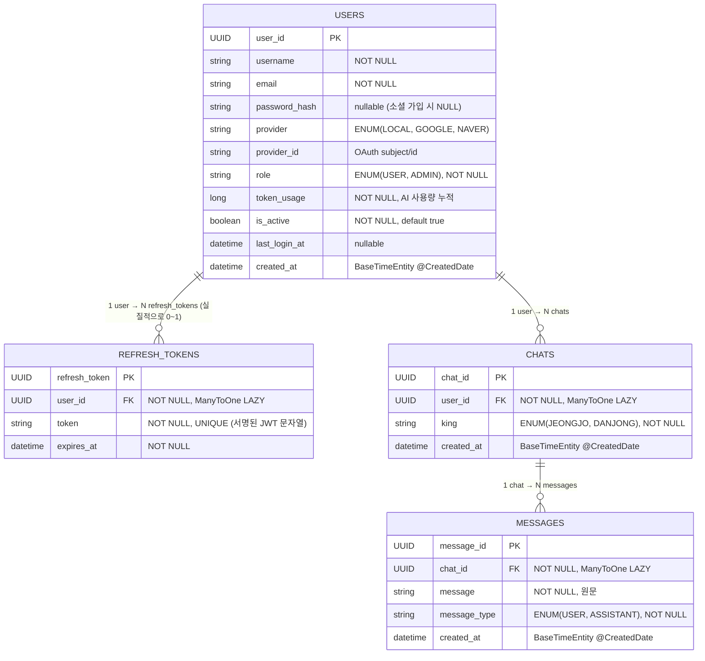

# Histolog Backend - ERD

> JPA 엔티티 기반 ERD. Oracle DB 사용, PK는 모두 UUID(`GenerationType.UUID`).

## 1. 엔티티 관계도

---

## 2. 테이블별 상세

### 2.1 `users`

| 컬럼 | 타입 | 제약 | 설명 |
|---|---|---|---|
| `user_id` | UUID | PK | 자동 생성 (`GenerationType.UUID`) |
| `username` | VARCHAR | NOT NULL | OAuth의 경우 email 앞부분 또는 name으로 자동 산출 |
| `email` | VARCHAR | NOT NULL | provider별 unique 보장은 코드에서만 (DB unique X) |
| `password_hash` | VARCHAR | nullable | LOCAL 가입 시에만 BCrypt 해시 저장. 소셜은 NULL |
| `provider` | VARCHAR(ENUM) | nullable | `LOCAL` / `GOOGLE` / `NAVER` |
| `provider_id` | VARCHAR | nullable | OAuth subject(Google `sub`, Naver `id`) |
| `role` | VARCHAR(ENUM) | NOT NULL | `USER` / `ADMIN` |
| `token_usage` | NUMBER | NOT NULL | AI 호출 누적 토큰. 2시간마다 cron으로 0 리셋 |
| `is_active` | BOOLEAN | NOT NULL, default true | 비활성화 플래그 (현재 코드에선 미사용) |
| `last_login_at` | TIMESTAMP | nullable | 로그인/소셜 콜백 시 갱신 |
| `created_at` | TIMESTAMP | `@CreatedDate` | JPA Auditing |

**유니크 식별 키 (애플리케이션 레벨)**

- LOCAL: `username`, `email` 각각 중복 불가 (signup 시 체크)
- 소셜: `(provider, provider_id)` 로 조회

### 2.2 `refresh_tokens`

| 컬럼 | 타입 | 제약 | 설명 |
|---|---|---|---|
| `refresh_token` | UUID | PK | row 식별자. **실제 토큰 문자열이 아님** |
| `user_id` | UUID | FK → users.user_id, NOT NULL | ManyToOne LAZY |
| `token` | VARCHAR | NOT NULL, UNIQUE | 서명된 JWT refresh 토큰 문자열 |
| `expires_at` | TIMESTAMP | NOT NULL | 발급 시점 + 7일 |

**운영 규칙**

- 로그인/소셜 로그인 시 `deleteByUser(user)` 후 새로 1건 insert ⇒ user당 활성 refresh token은 사실상 1개.
- `/api/auth/refresh` 호출 시 `rotate(newToken, newExpiresAt)` 로 같은 row를 갱신.

### 2.3 `chats`

| 컬럼 | 타입 | 제약 | 설명 |
|---|---|---|---|
| `chat_id` | UUID | PK | |
| `user_id` | UUID | FK → users.user_id, NOT NULL | 소유자 |
| `king` | VARCHAR(ENUM) | NOT NULL | `JEONGJO` / `DANJONG` — 대화 상대 |
| `created_at` | TIMESTAMP | `@CreatedDate` | |

조회 쿼리:

- `findByUserUserIdOrderByCreatedAtDesc(userId)` — 사이드바용 목록
- `findByUserUserIdAndChatId(userId, chatId)` — 소유권 검증 포함 단건 조회

### 2.4 `messages`

| 컬럼 | 타입 | 제약 | 설명 |
|---|---|---|---|
| `message_id` | UUID | PK | |
| `chat_id` | UUID | FK → chats.chat_id, NOT NULL | |
| `message` | VARCHAR | NOT NULL | 사용자/AI 메시지 원문 |
| `message_type` | VARCHAR(ENUM) | NOT NULL | `USER` / `ASSISTANT` |
| `created_at` | TIMESTAMP | `@CreatedDate` | |

조회 쿼리:

- `findByChatChatIdOrderByCreatedAtAsc(chatId)` — 메시지 시계열 조회

---

## 3. 관계 카디널리티

| 관계 | 카디널리티 | 주석 |
|---|---|---|
| User – RefreshToken | 1 : N (실제 운영 0~1) | 로그인할 때마다 기존 row 삭제 후 1건 insert |
| User – Chat | 1 : N | user 삭제 정책 미정 (cascade 설정 없음 → user 삭제 시 FK 위반 가능성) |
| Chat – Message | 1 : N | chat 삭제 정책 미정 (동일) |

---

## 4. ENUM 정리

| Enum | 값 |
|---|---|
| `AuthProvider` | `LOCAL`, `GOOGLE`, `NAVER` |
| `UserRole` | `USER`, `ADMIN` |
| `King` | `JEONGJO`(정조), `DANJONG`(단종) |
| `MessageType` | `USER`, `ASSISTANT` |

저장 형식: `@Enumerated(EnumType.STRING)` — DB에는 문자열로 그대로 저장됨.
