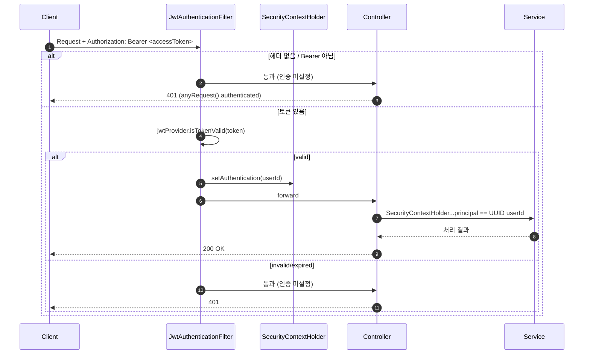
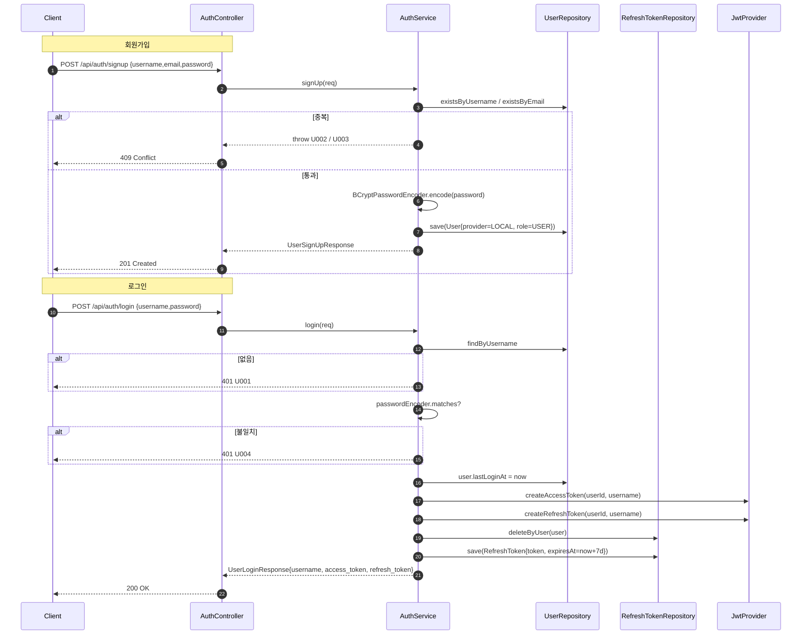
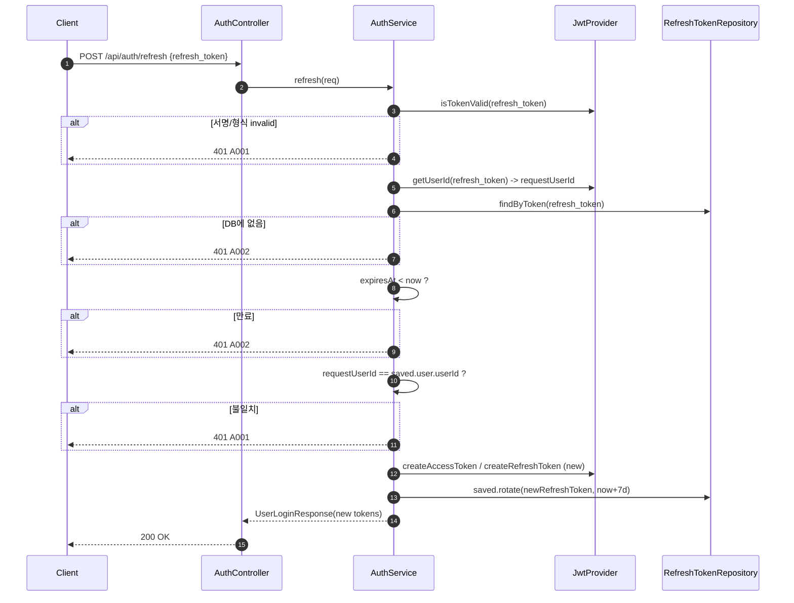
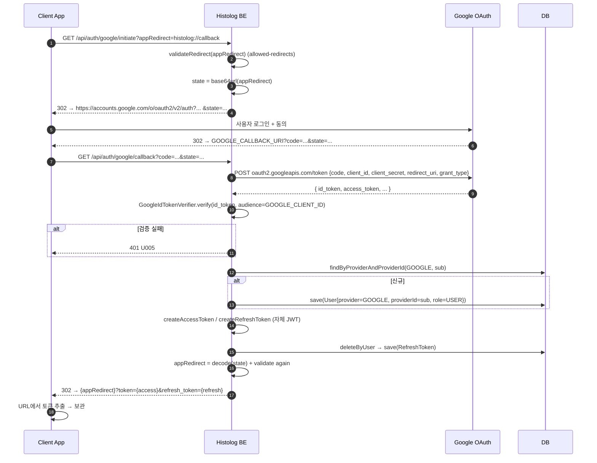
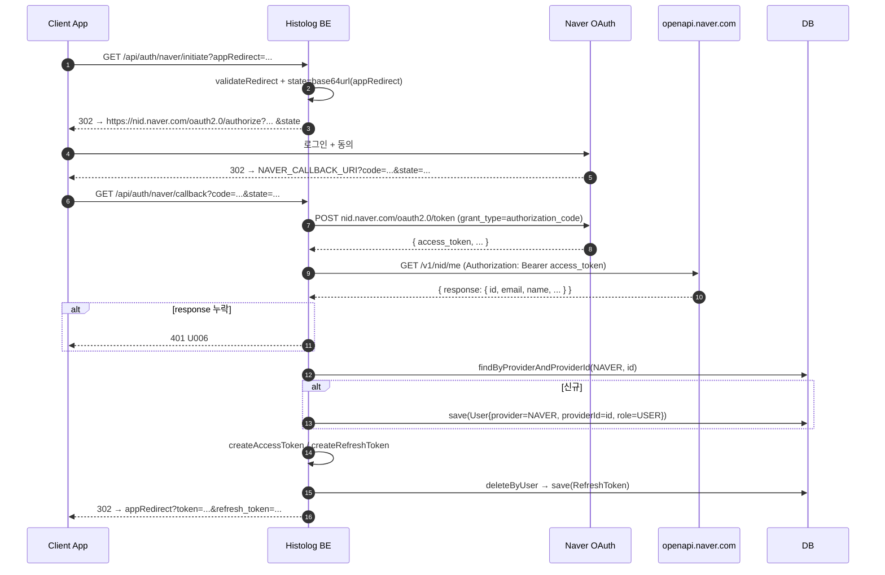

# Histolog Backend - OAuth & 인증 흐름

> Spring Security STATELESS + 자체 JWT(access/refresh) + Google/Naver OAuth2

## 1. 인증 아키텍처 한 줄 요약

외부 OAuth로는 **사용자 확인만** 하고, 클라이언트와의 통신은 **자체 발급 JWT(access + refresh)** 로 한다. RefreshToken은 DB에 저장해 rotate · 무효화한다.

| 토큰 | 만료 | 저장 위치 |
|---|---|---|
| Access Token | 30분 | 클라이언트만 보관 (DB 저장 X) |
| Refresh Token | 7일 | `refresh_tokens` 테이블에 user당 1개 |

핵심 컴포넌트:

- `JwtProvider` — HMAC-SHA로 서명, subject=`userId(UUID)`, claim `username`
- `JwtAuthenticationFilter` — 매 요청에서 Authorization 헤더 파싱 → `SecurityContext`에 `userId` 세팅
- `AuthService` — 회원가입/로그인/리프레시/Google·Naver 콜백 처리
- `SecurityConfig` — `/api/auth/**` permitAll, 그 외 authenticated, CSRF off, STATELESS

---

## 2. 전체 요청 인증 흐름 (보호 API 호출 시)



---

## 3. 로컬 회원가입 / 로그인 흐름



---

## 4. Refresh Token Rotate 흐름



rotate 후에도 **동일 row를 업데이트**하므로, 도난된 옛 refresh token은 즉시 무효가 된다.

---

## 5. Google OAuth 흐름

Authorization Code Flow + `id_token` 검증 방식.



### 보안 포인트

- `appRedirect` 는 화이트리스트(`app.allowed-redirects`) prefix 매칭으로 검증. **callback 진입 후에도 다시 검증**해 state 변조에 대비.
- `state` 는 단순 base64로만 인코딩되어 있어 **위조 방지/리플레이 방지용 nonce가 아님** — appRedirect 전달 용도. CSRF 방어가 추가로 필요하다면 random nonce + 서버 측 저장이 필요.
- 토큰을 URL 쿼리스트링으로 전달 → 브라우저 history/로그에 남을 수 있음. 모바일/네이티브 deep-link 사용을 전제로 한 설계.

---

## 6. Naver OAuth 흐름

Google과 다르게 **id_token이 없어 access_token으로 userinfo API를 한 번 더 호출**한다.



---

## 7. 사용자 식별 규칙 (provider별)

| Provider | `providerId` 출처 | `username` 산출 |
|---|---|---|
| LOCAL | (사용 안 함) | 회원가입 입력값 |
| GOOGLE | `id_token.sub` | `email`의 `@` 앞부분, 없으면 `payload.name` |
| NAVER | `response.id` | `email`의 `@` 앞부분, 없으면 `response.name` |

> 동일 이메일이라도 provider가 다르면 다른 User로 취급된다. (`(provider, providerId)` 조회 기준)

---

## 8. 보호 경로 정책 요약

```text
SecurityFilterChain:
  cors                     → 모든 origin pattern 허용, credentials 허용
  csrf                     → disable (REST + JWT 전제)
  sessionCreationPolicy    → STATELESS
  /api/auth/**             → permitAll
  그 외                     → authenticated
  filter chain             → JwtAuthenticationFilter @ before UsernamePasswordAuthenticationFilter
```

토큰이 무효해도 `JwtAuthenticationFilter` 자체에서 401 응답을 만들어 보내지는 않는다. `SecurityContext`만 비워둔 채 다음 필터로 넘기고, 최종적으로 `authorizeHttpRequests` 규칙에서 401/403이 나간다.
